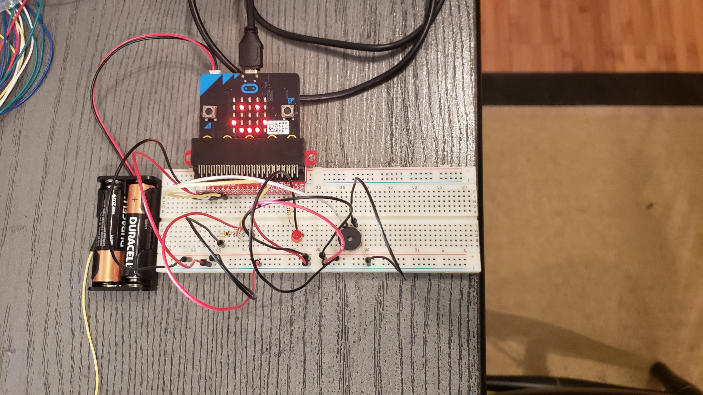
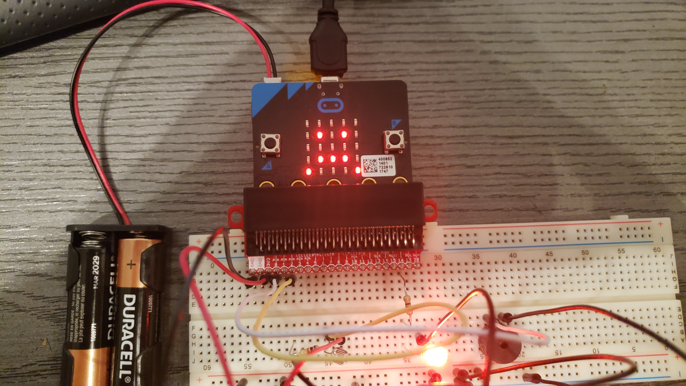
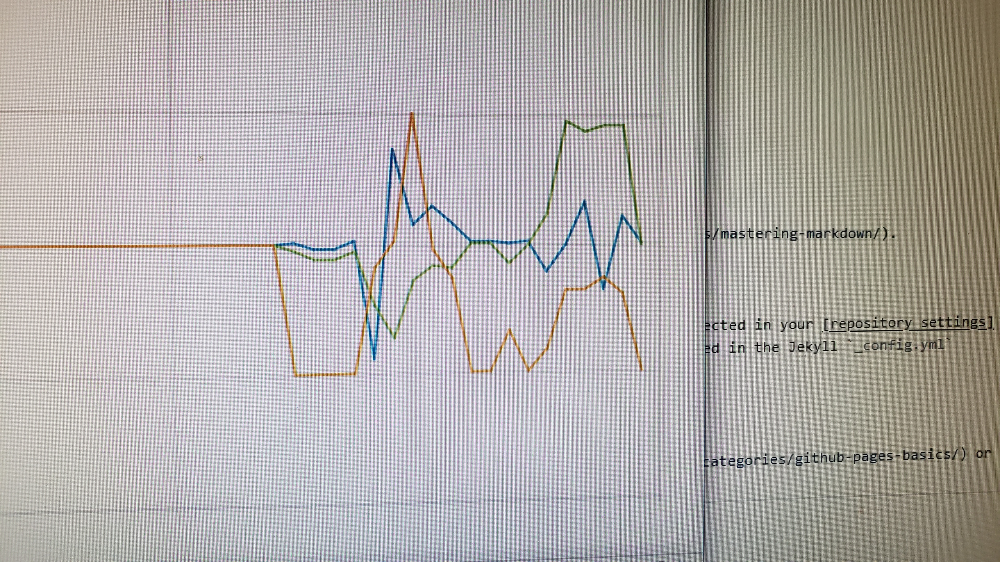

# Welcome to the Unit 2 reflection page

The primary focus of Unit 2 was to think about the Internet of Things (IoT) and how a device c
ould be developed and intergrated into it. My final project started off as a sensor to implement 
in a safe. Where when the safe door is opened a key would be required or a message would be sent. 
Integrating the last two aspects into the microbit, proved to be too large for the microbit 
capacity when utilizing micropy. So the project transitioned to a package sensor. 

## **Package Sensor**

As a reusable package sensor, the microbit with photoresistor, allows the tracking of the package's angles, 
if it is dropped, and if it has been opened. Combined into a battery operated single sensor, it allows the 
recipient to track how the package was treated throughout the delivery. Having used some of the individual 
tilt and shock indicators (usually around $3 each), it seemed like a great task for such a small electronic.
The biggest drawback in utilizing the microbit as a sensor came about with how quickly it can create the 
data sets. Finding an appropriate balance where the end data was manageable while not missing any particular 
'event'. The solution came about just by trial and error, just to ensure the sleep cycle did not interfere 
between the speed the photoresistor comparison needs to happen in versus the tilt changes.

### **Accelerometer**
The microbit accelerometer is used to identify the angles at which the microbit has shifted. 
Using this tool one can see if the package has surpassed a designated angle. Unlike a normal 
tilt indicator, utilizing a microbit for this shows for how long the package was kept above 
a certain angle, and if it ever reached angles surpassing the limits of standard tilt indicators.

### **Data**

Even though the microbit offers very little data storage, the data storage simplicity as a CSV 
(comma seperated variables), mean it is easy and quickly integrated into a MySQL database, or 
even analyzed just using Microsoft Excel.

To return to my profile page [Click Here](https://frantzl-cyber.github.io/FL_portfolio/).
